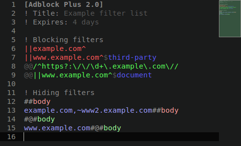
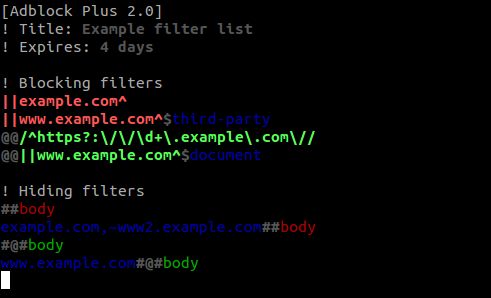

# Adblock Plus Filter List syntax

[Sublime Text 3][st3] and VIM syntax definition and color scheme for [Adblock Plus filter lists][abp]. The Sublime Text color scheme is based on [FreshCut by Dayle Rees][freshcut].

## Installation

### Use prebuilt files

- Sublime Text
    - Copy all files in `sublime` directory into Sublime Text's `Packages/User` directory.
- VIM
    - Copy `vim/ftdetect/abp.vim` into `~/.vim/ftdetect` directory.
    - Copy `vim/syntax/abp.vim` into `~/.vim/syntax` directory.

### Build it yourself

1. Install [syntax tools][syntax-tools]
2. Create and deploy files
    - Sublime Text: `<path-to-syntax-tools>/build abp src/sublime`
    - VIM: `<path-to-syntax-tools>/build abp src/vim`

[abp]: https://adblockplus.org/en/filters
[freshcut]: https://github.com/daylerees/colour-schemes/blob/master/legacy/Contrast/FreshCut.tmTheme
[st3]: http://www.sublimetext.com/
[syntax-tools]: https://github.com/ThomasGreiner/syntax-tools
